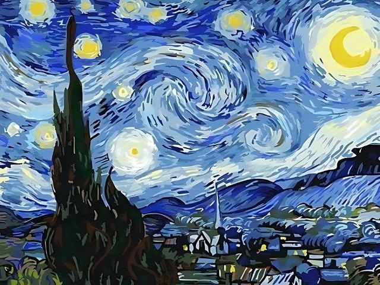

# Image Matrix Inversion Experiment

A small experimental project that takes an image as input, extracts its RGB values into separate **R**, **G**, and **B** matrices, computes matrix inverses, and rebuilds the image from the transformed pixel values.

The result will likely be a visual mess rather than a close reconstruction of the original image. The goal is experimentation, not image quality.

## Current Status

Inverse algorithms have been written in **Python** and **Rust**.

## Methods

| Algorithm | Complexity |
|---|---:|
| Laplace / Cofactor Expansion | O(n!) |
| Gaussian Row Elimination | O(n³) |
| Gauss-Jordan Elimination | O(n³) |

## Results

<table>
  <tr>
    <td align="center">
      
       
      <b>Original</b> 
       
      <i>(Van Gogh's Starry Night)</i>
    </td>
    <td align="center" width="80">
      <h1>→</h1>
    </td>
    <td align="center" width="300">
      <i>Result image coming soon</i>
       
    </td>
  </tr>
</table>
