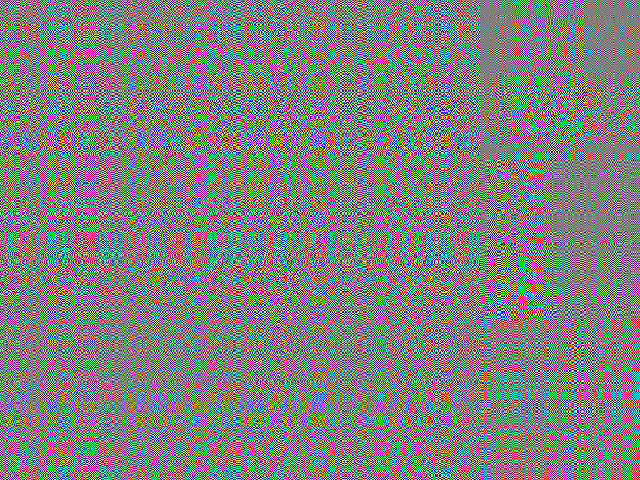
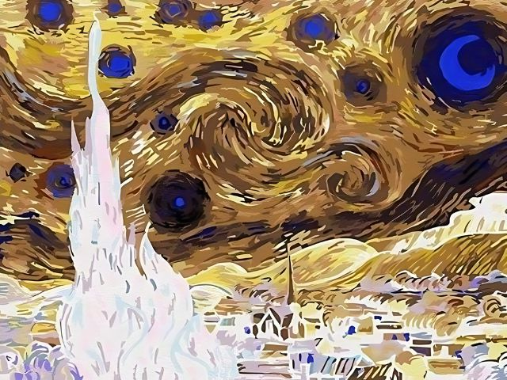
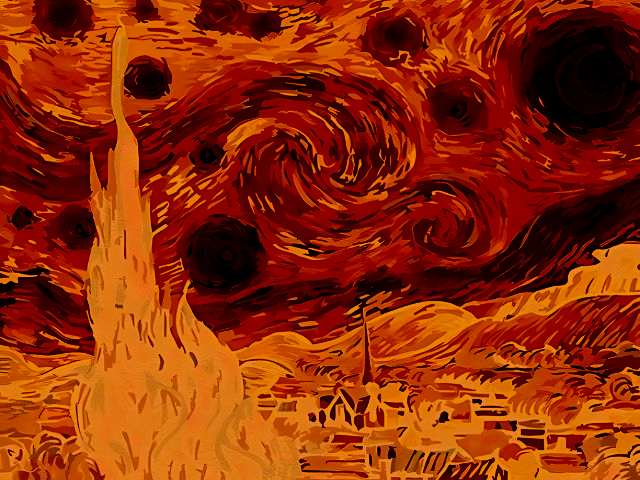
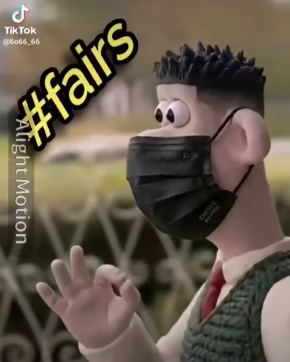
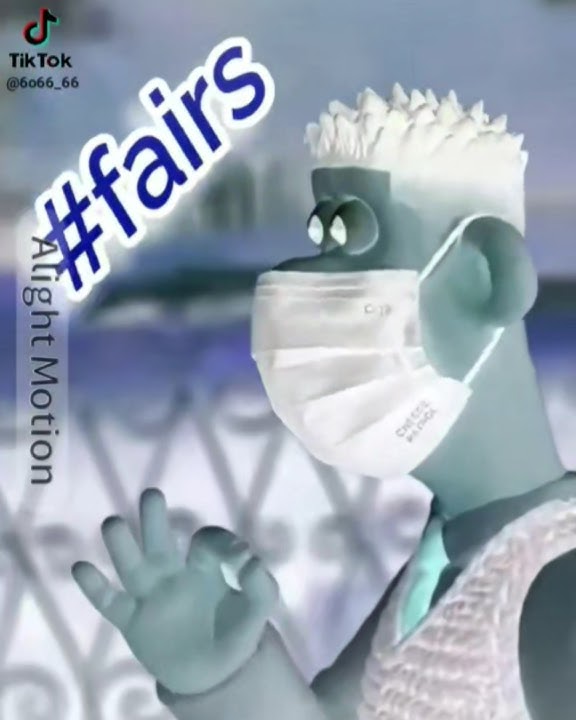
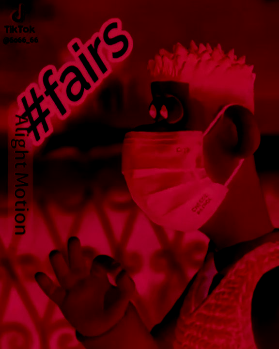

# Image Matrix Inversion Experiment

A small experimental project that takes an image as input, extracts its RGB values into separate **R**, **G**, and **B** matrices, computes matrix inverses, and rebuilds the image from the transformed pixel values.

The goal is experimentation, not image quality.

## Current Status

Inverse algorithms have been written in **Python** and **Rust**.  
Image modification code has been written in **Rust** using the **Image** crate.

## Methods

| Algorithm | Complexity |
|---|---:|
| Laplace / Cofactor Expansion | O(n!) |
| Gaussian Row Elimination | O(n³) |
| Gauss-Jordan Elimination | O(n³) |

## Results

<table>
  <tr>
    <td align="center">
      
       
      <b>Original</b> 
       
      <i>(Van Gogh's Starry Night)</i>
    </td>
    <td align="center" width="80">
      <h1>→</h1>
    </td>
    <td align="center" width="300">
      
       
      <b>After Matrix Inversion</b>
       
      <i>(Waterantonio103's Not So Starry Night)</i>
    </td>
  </tr>
</table>

# Other Modifications Tested

## Inverting the pixels

## Clamping RGB Channel Values by a fixed amount per channel

<table>
  <tr>
    <td align="center">
      
       
      <b>Original</b> 
       
      <i>(#fairs 👌)</i>
    </td>
    <td align="center" width="80">
      <h1>→</h1>
    </td>
    <td align="center" width="300">
      
       
      <b>After Inverting</b>
       
      <i>(👌👌👌)</i>
    </td>
  </tr>
</table>

